# Praxis Studio

Praxis Studio helps engineers do good engineering before asking them to produce safety paperwork. It provides a structured workspace for defining the system, understanding how it will be used, exploring architecture, making design decisions, and recording the reasoning and evidence behind those decisions.

As the engineering workflow develops, Praxis Studio helps the team identify the points where a decision could introduce, increase, or reduce risk. Engineers can place safety checkpoints at those points, define what must be reviewed before work proceeds, and connect each checkpoint to the appropriate analysis, requirement, owner, and verification evidence. Safety becomes an integrated outcome of disciplined, traceable engineering rather than a separate activity added near the end.

Architecture, operational context, hazards, integrity assessments, FMEA records, and requirements remain together in one traceable project, helping teams develop critical systems with greater clarity, confidence, and assurance.

The initial browser workspace ships with an example cobot-cell safety case so the workflow is visible immediately after startup. Deleting the final browser workspace creates a blank replacement.

## License and Safety Notice

Praxis Studio is released under the [MIT License](LICENSE) for public use, modification, and distribution.

Praxis Studio was developed with AI-assisted workflows, including large language model support and vibe-coding practices. Review the implementation, calculations, assumptions, generated content, and project outputs carefully before relying on them.

The software is provided **as is**, without warranty of any kind and without liability for claims, damages, production losses, safety incidents, compliance gaps, or other issues arising from use of the app or its outputs. Praxis Studio is an engineering support tool, not a certified safety system, conformity-assessment body, or substitute for competent engineering judgment. Before using any analysis, calculation, requirement, evidence record, or exported project in a production system, have it independently reviewed and approved by qualified professionals against the applicable laws, standards, operating context, and organizational safety processes.

## Feature Snapshot

| Workspace | Capabilities |
| --- | --- |
| Overview | Safety-case metrics, residual-risk summary, high-priority failure modes, analysis coverage, and architecture components in scope |
| Engineering notes | Capture rich text, equations, tables, figures, artifact links, and stakeholder FMEA/HARA drafts that can be cleaned and imported |
| Engineering workflow | Configure development phases and activities, insert safety checkpoints, define gate criteria, record evidence, assign owners, and launch linked analyses |
| Architecture | Paste PlantUML source, render an SVG diagram locally, and import component aliases as reusable references |
| Operational situations | Catalogue normal operation, setup, intervention, maintenance, and other relevant operating contexts |
| Hazard catalogue | Maintain reusable hazards and view linked analysis references |
| AMR SIL assessment | Estimate a target Safety Integrity Level for AMR safety functions with a transparent C/F/P/W risk graph |
| Quantitative safety | Connect reliability inputs to architecture components, calculate residual dangerous failure rates, estimate PFH or PFDavg, and review redundancy needs |
| FMEDA worksheet | Classify architecture-linked hardware failure modes, evaluate symbolic failure-rate expressions, and roll up λS, λDD, λDU, DC, and SFF |
| Fault tree analysis | Model top events with a DSL, render nested/layered fault trees, generate starting trees from architecture, and derive qualitative minimal cut sets |
| ISO 26262 HARA | Create hazardous events, classify severity (`S0`-`S3`), exposure (`E0`-`E4`), and controllability (`C0`-`C3`), then derive ASIL automatically |
| Safety goals | Define top-level safety objectives with ASIL, safe state, FTTI, and hazardous-event traceability |
| FMEA worksheet | Record component failure modes, effects, linked hazards and situations, recommended actions, and automatic RPN scoring |
| Custom FMEA templates | Add and remove organization-specific worksheet columns |
| Safety requirements | Define mitigations, allocate them to architecture components, link source hazards, and track verification status |
| Lifecycle assurance | Execute verification and validation, derive traceability coverage, control evidence and deviations, assess changes, approve baselines and reviews, manage interfaces and hazard closure, monitor RAM objectives, and build safety-case claims |
| Workspace data | Switch and delete local projects, save or open portable project files on disk, and use browser Back/Forward to revisit projects and feature views |
| Input guidance | Open contextual help for rating scales, failure-rate units, bounded fractions, FMEDA symbols, and project-file handling |

## Feature Figures

Select any figure to open the full-resolution snapshot.

<table>
  <tr><th>Overview</th><th>Engineering notes</th></tr>
  <tr>
    <td><a href="docs/images/features/overview.png">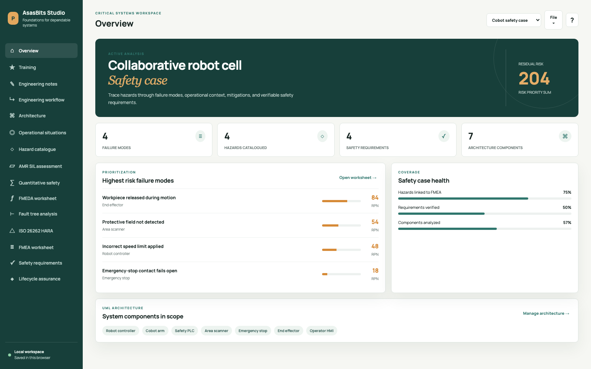</a></td>
    <td><a href="docs/images/features/engineering-notes.png">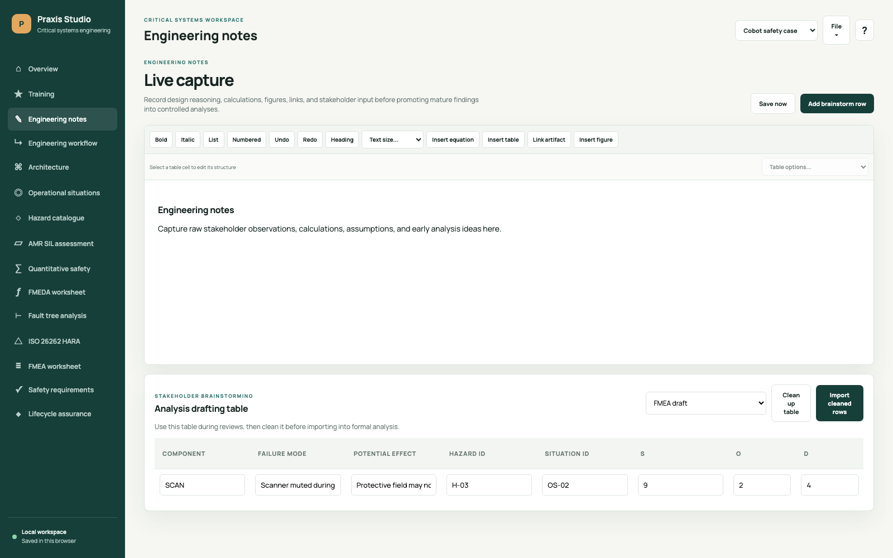</a></td>
  </tr>
  <tr><th>Engineering workflow</th><th>Architecture</th></tr>
  <tr>
    <td><a href="docs/images/features/engineering-workflow.png">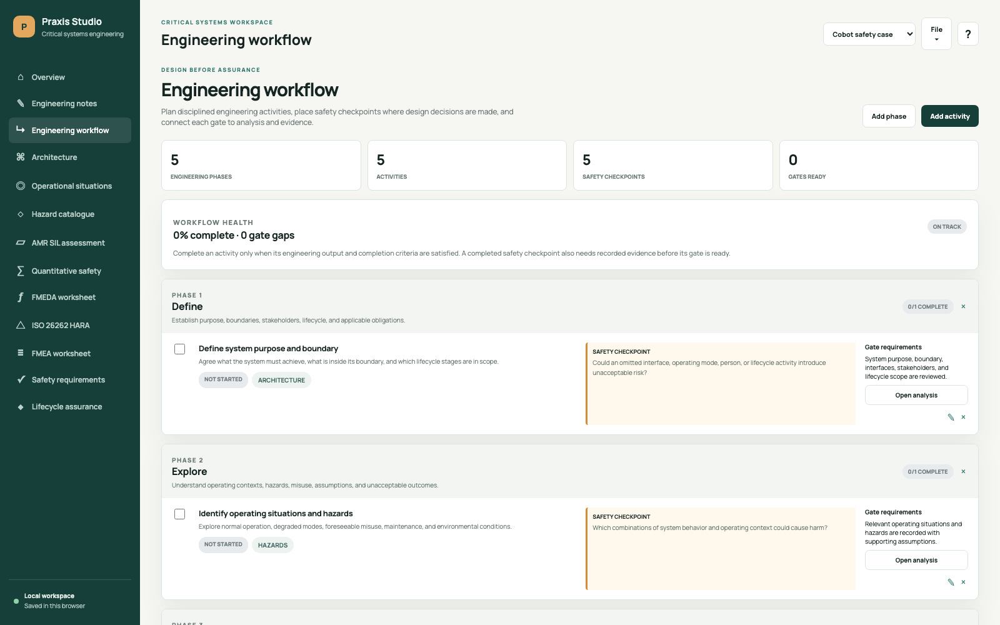</a></td>
    <td><a href="docs/images/features/architecture.png">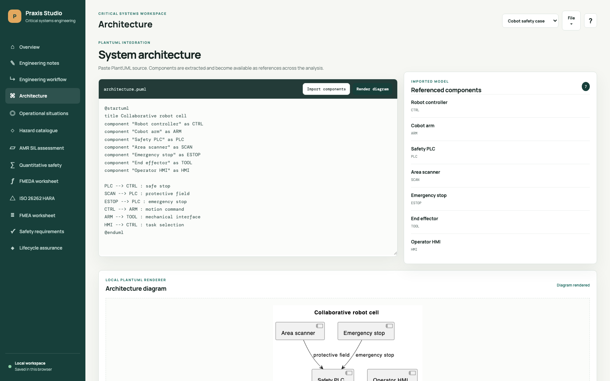</a></td>
  </tr>
  <tr><th>Operational situations</th><th>Hazard catalogue</th></tr>
  <tr>
    <td><a href="docs/images/features/operational-situations.png">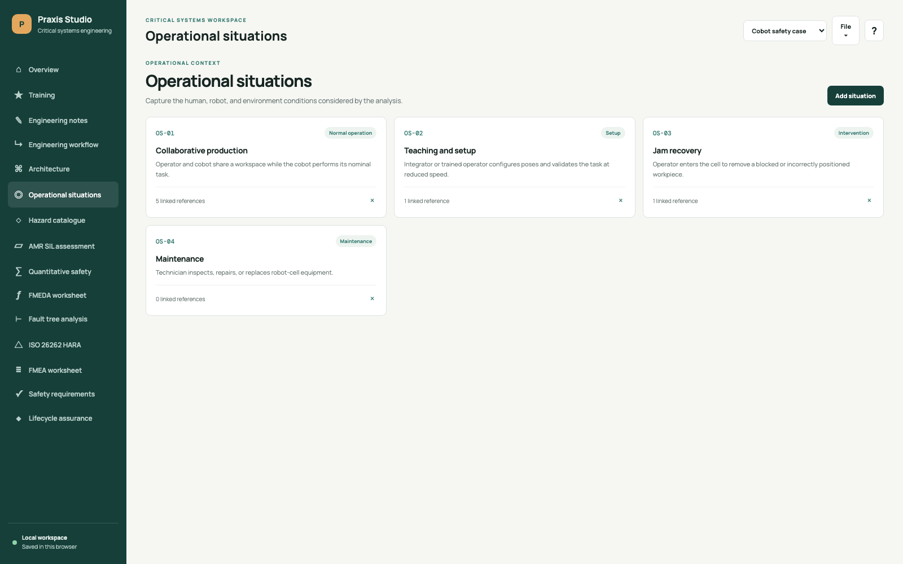</a></td>
    <td><a href="docs/images/features/hazard-catalogue.png">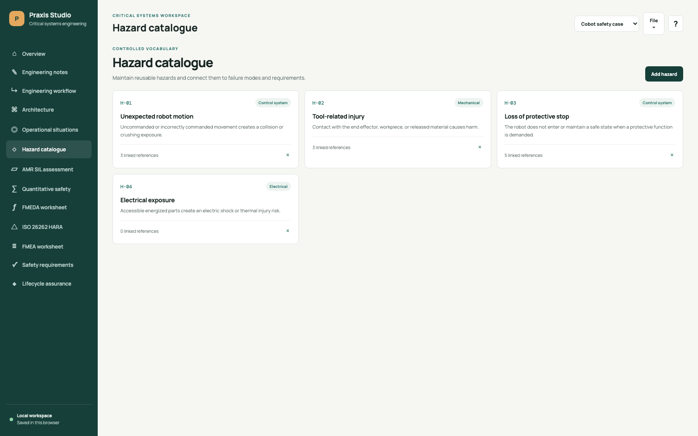</a></td>
  </tr>
  <tr><th>AMR SIL assessment</th><th>Quantitative safety</th></tr>
  <tr>
    <td><a href="docs/images/features/amr-sil-assessment.png">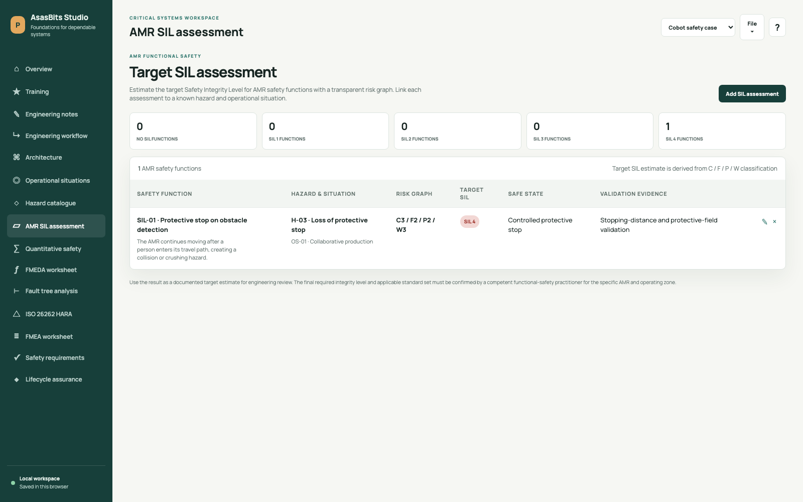</a></td>
    <td><a href="docs/images/features/quantitative-safety.png">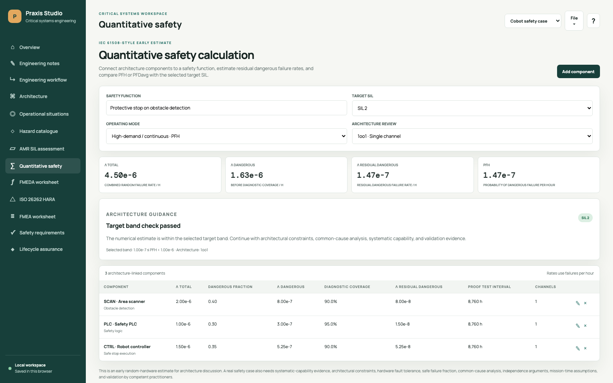</a></td>
  </tr>
  <tr><th>FMEDA worksheet</th><th>ISO 26262 HARA and safety goals</th></tr>
  <tr>
    <td><a href="docs/images/features/fmeda-worksheet.png">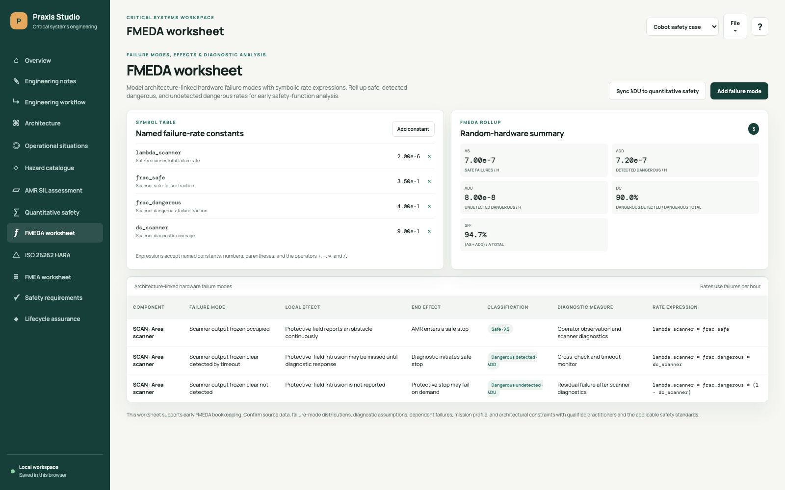</a></td>
    <td><a href="docs/images/features/iso-26262-hara.png">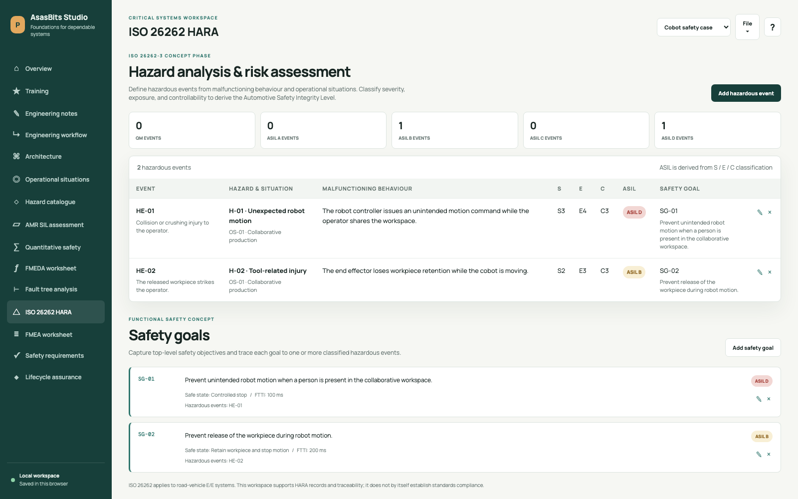</a></td>
  </tr>
  <tr><th>FMEA worksheet</th><th>Custom FMEA templates</th></tr>
  <tr>
    <td><a href="docs/images/features/fmea-worksheet.png">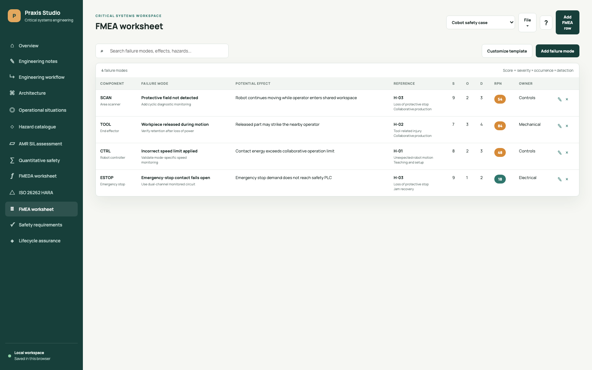</a></td>
    <td><a href="docs/images/features/custom-fmea-template.png">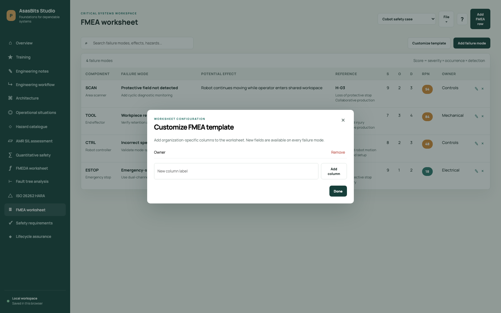</a></td>
  </tr>
  <tr><th>Safety requirements</th><th>Lifecycle assurance</th></tr>
  <tr>
    <td><a href="docs/images/features/safety-requirements.png">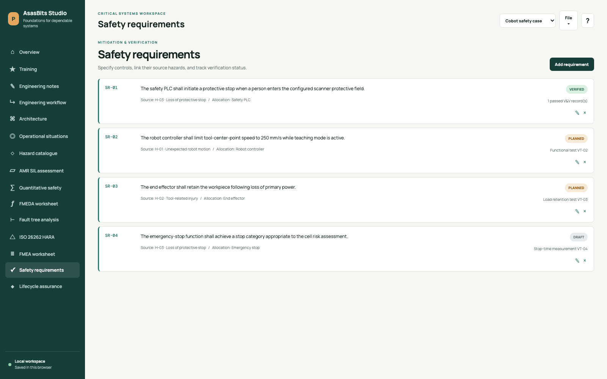</a></td>
    <td><a href="docs/images/features/lifecycle-assurance.png">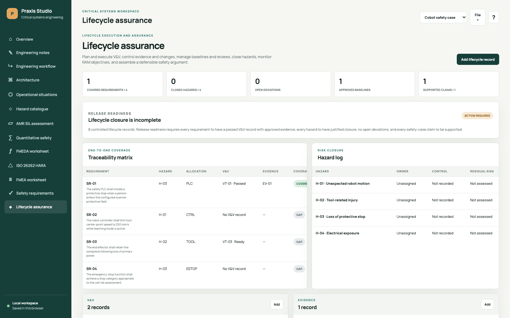</a></td>
  </tr>
  <tr><th>Workspace data</th><th>Input guidance</th></tr>
  <tr>
    <td><a href="docs/images/features/workspace-data.png">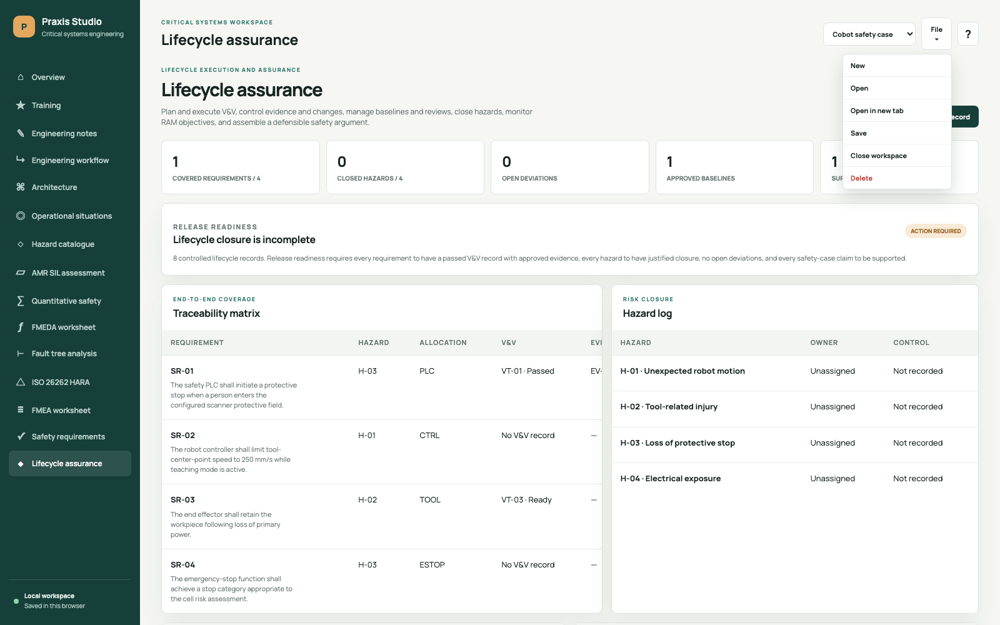</a></td>
    <td><a href="docs/images/features/input-guidance.png">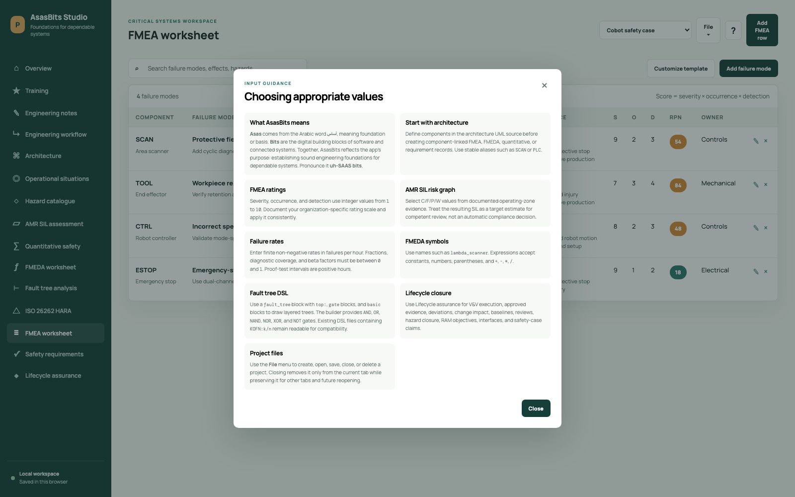</a></td>
  </tr>
</table>

Refresh the figures after a UI change with:

```sh
bun run screenshots
```

## Requirements

- [Bun](https://bun.sh/) for the local server and browser test suite
- Java 17 or later for PlantUML rendering
- A modern browser
- Google Chrome for the automated interaction suite

The official PlantUML `v1.2026.4` JAR is attached at [`vendor/plantuml.jar`](vendor/plantuml.jar). Rendering is local: PlantUML source does not leave the machine.

## Beginner Training

For an industry-style learning path, use the [`Robotic Cell Engineering Practicum`](training/robotic-cell-practicum.md) with its completed [`palletizing-cell.praxis.json`](training/examples/palletizing-cell.praxis.json) project.

The shorter [`AMR Robot Safety Training`](training/README.md) remains available as an introductory course. Training assets include:

- Five beginner modules
- A runnable warehouse-AMR PlantUML example
- A detailed palletizing-cell project covering Engineering notes, workflow, architecture, hazards, safety functions, FMEA, FMEDA, requirements, validation, and change impact
- Working SIL, FMEA, and safety-requirement examples
- Student tasks and a capstone assessment
- A separate instructor answer key

For railway systems engineering, use the [`EN 50126 Railway RAMS Practicum`](training/en-50126-rams-practicum.md) with its completed [`metro-psd-rams.praxis.json`](training/examples/metro-psd-rams.praxis.json) project and [`instructor answer key`](training/en-50126-answer-key.md). It covers the 12-phase RAMS lifecycle, system definition, RAM requirements, hazard control, apportionment, assurance, acceptance, operation, modification, and decommissioning.

For experience-based interview preparation, use the [`Critical Systems Lifecycle Interview Practicum`](training/lifecycle-interview-practicum.md), its [`interview guide`](training/lifecycle-interview-answer-key.md), and the reusable [`story workbook`](training/interview-story-workbook.md). The course provides a two-week practice schedule, fourteen lifecycle simulations, failed-test and field-incident exercises, management-pressure scenarios, timed questions, follow-up probes, and an evidence-based scoring rubric.

## Start The App

Run:

```sh
bun server.js
```

The server compiles the TypeScript browser source before starting. To build the browser artifact without starting the server, run:

```sh
bun run build
```

Open:

```text
http://localhost:8080
```

Opening `index.html` directly still provides the analysis workspace, but diagram rendering requires the local server.

## Suggested Workflow

1. Open **Engineering workflow** to plan phases, activities, safety checkpoints, gates, and evidence.
2. Open **Architecture**, paste or update the PlantUML model, and select **Render diagram**.
3. Select **Import components** so PlantUML aliases become available as references in the analysis.
4. Add the relevant **Operational situations**.
5. Maintain the reusable **Hazard catalogue**.
6. Use **ISO 26262 HARA** to create hazardous events and derive ASIL from S/E/C classifications.
7. For an AMR application, use **AMR SIL assessment** to estimate the target SIL for each safety function.
8. Add **Safety goals** for the classified hazardous events.
9. Use **Quantitative safety** to add component failure-rate assumptions and compare PFH or PFDavg with the target SIL.
10. Use the **FMEDA worksheet** to classify hardware failure modes and evaluate symbolic rate expressions.
11. Use the **FMEA worksheet** to assess component-level failure modes and prioritize actions by risk priority number.
12. Add **Safety requirements**, linking each control to its source hazard and allocated architecture component.
13. Use **Lifecycle assurance** to execute V&V, approve evidence, close deviations and hazards, assess changes, establish baselines, record reviews, and support safety-case claims.
14. Use the top-bar controls to save the active project as a portable `.praxis.json` file.

## Using Each Workspace

### Engineering Notes

Use the Engineering notes workspace for raw engineering thinking before information is mature enough for a controlled worksheet. Rich notes can include headings, emphasis, lists, equations, editable tables, embedded figures, and links to other Praxis Studio artifacts. Notes auto-save while you type. Select a table cell to add or delete surrounding rows and columns, or remove the complete table.

For stakeholder reviews, select an **FMEA draft** or **HARA draft**, add rows, and capture ideas collaboratively. **Clean up table** trims text, removes empty drafts, normalizes ratings, and identifies missing references. **Import cleaned rows** promotes valid entries into the formal FMEA or HARA worksheet while retaining incomplete rows for correction.

### Engineering Workflow

The workflow starts with a generic critical-systems template covering definition, exploration, architecture, specification, verification, and assurance.

- Add phases and activities to reflect the project's development lifecycle.
- Add safety checkpoints where engineering decisions can introduce or reduce risk.
- Link activities to architecture, hazard analysis, FMEA, FMEDA, SIL, quantitative analysis, or requirements.
- Map activities to applicable standards clauses or internal assurance objectives.
- Define completion criteria and record evidence before treating a gate as ready.
- Use owners and activity status to make open engineering work visible.

Safety is treated as a continuous engineering lens rather than a single downstream review phase.

### Architecture

Paste PlantUML into the editor and select:

- Use the autocomplete menu while typing common PlantUML keywords. Select a snippet with `ArrowUp` / `ArrowDown` and insert it with `Enter` or `Tab`.
- **Render diagram** to generate an SVG preview with the attached JAR.
- **Import components** to extract references for FMEA rows and safety requirements.

The importer recognizes `component`, `node`, `database`, `queue`, `cloud`, `rectangle`, `artifact`, `package`, and `frame` declarations.

### Operational Situations And Hazards

Use **Add situation** and **Add hazard** to maintain reusable catalogues. Catalogue entries that are already referenced by an analysis record cannot be deleted until those references are removed.

### ISO 26262 HARA

Use **Add hazardous event** to combine a hazard with an operational situation and describe:

- Malfunctioning behaviour
- Potential harm or consequence
- Severity, exposure, and controllability
- Linked safety goal

The app derives the Automotive Safety Integrity Level automatically. Add safety goals with **Add safety goal** and capture the safe state and fault tolerant time interval (FTTI).

ISO 26262 is intended for safety-related E/E systems installed in series-production road vehicles. This app supports HARA records and traceability; using it does not by itself establish standards compliance.

Reference: [ISO 26262-3:2018 - Road vehicles - Functional safety - Part 3: Concept phase](https://www.iso.org/standard/68385.html).

### AMR SIL Assessment

Use **Add SIL assessment** to estimate a target SIL for an AMR safety function. Each assessment records:

- Safety function, such as protective stop on obstacle detection
- Linked hazard and operational situation
- Hazardous event and potential consequence
- Consequence (`C1`-`C4`)
- Exposure frequency (`F1`-`F2`)
- Possibility of avoidance (`P1`-`P2`)
- Probability of the unwanted occurrence or demand (`W1`-`W3`)
- Safe state and validation evidence

The app uses the selected C/F/P/W values to display a transparent target estimate from **No SIL** through **SIL 4**. Treat the result as an engineering input for review, not an automatic compliance decision. The final required integrity level depends on the AMR type, safety function, operating zone, applicable machinery standards, and the organization's accepted risk-assessment method.

[ISO 3691-4:2023](https://www.iso.org/standard/83545.html) specifies safety requirements and verification means for driverless industrial trucks and explicitly includes autonomous mobile robots among its examples. For functional-safety lifecycle and SIL concepts, consult the applicable IEC 61508-family standard and competent functional-safety practitioners.

### Quantitative Safety Calculation

Use **Quantitative safety** for an early random-hardware estimate. Select a safety function, target SIL, and operating mode:

- **High-demand / continuous** calculates the probability of dangerous failure per hour (`PFH`).
- **Low-demand** calculates the average probability of failure on demand (`PFDavg`).

Add architecture-linked components and provide:

- Total failure rate `λ`
- Dangerous failure fraction
- Diagnostic coverage (`DC`)
- Proof-test interval (`T1`)
- One or two channels
- Common-cause beta factor for a simplified two-channel estimate

The app displays:

```text
λD = λ x dangerous fraction
λDU = λD x (1 - DC)
PFH ≈ sum of residual λDU values
PFDavg ≈ sum of residual λDU x T1 / 2
```

For two channels, the app combines an independent dual-channel term with a beta-factor common-cause term. This is useful for early architecture discussion, but it is not a complete FMEDA.

The guidance panel compares the numerical estimate with the selected target SIL and prompts a redundant-architecture review for higher-integrity designs. A valid safety case must also address hardware fault tolerance, safe failure fraction, common-cause failures, independence, systematic capability, proof-test effectiveness, and validation evidence.

[IEC 61508-1:2010](https://webstore.iec.ch/en/publication/5515) covers E/E/PE systems used to carry out safety functions. [IEC 61508-2:2010](https://webstore.iec.ch/en/publication/5516) specifies design and manufacture requirements for E/E/PE safety-related systems, including techniques and measures graded against SIL.

### FMEDA Worksheet

Use **FMEDA worksheet** for architecture-linked failure modes, effects, and diagnostic analysis. Classify each row as:

- Safe failure (`λS`)
- Dangerous detected failure (`λDD`)
- Dangerous undetected failure (`λDU`)
- No-effect failure (`λNE`)

Define named constants such as `lambda_scanner` and `dc_scanner`, then use them in symbolic expressions:

```text
lambda_scanner * frac_dangerous * (1 - dc_scanner)
```

The worksheet evaluates each expression without executing JavaScript and rolls up:

```text
DC = λDD / (λDD + λDU)
SFF = (λS + λDD) / λ total
```

Select **Sync λDU to quantitative safety** to copy architecture-component residual dangerous rates into the PFH/PFDavg calculator.

FMEDA quality depends on credible source data, failure-mode distributions, diagnostic assumptions, dependent-failure analysis, and expert review. The worksheet supports engineering analysis; it does not make a component or architecture compliant by itself.

Beginner lesson: [`training/fmeda-for-beginners.md`](training/fmeda-for-beginners.md).

### Fault Tree Analysis

Use **Fault tree analysis** to model top events deductively with a domain-specific language. The editor supports nested and layered diagrams, architecture-linked basic events, architecture-generated starter trees, and standard logical gates including `AND`, `OR`, `NAND`, `NOR`, `XOR`, `NOT`, and `KOFN:k/n`.

```text
TOP TOP "Loss of safety function"
GATE TOP OR "Top combinations" -> LOGIC VOTE
GATE LOGIC AND "Both channels fail" -> A B
GATE VOTE KOFN:2/3 "Two of three sensors fail" -> S1 S2 S3
BASIC A "Channel A dangerous failure" component=PLC layer=Logic
BASIC B "Channel B dangerous failure" component=CTRL layer=Logic
```

The app validates duplicate identifiers, unsupported gates, missing children, unreachable nodes, and cycles. Qualitative analysis derives reduced minimal cut sets for coherent portions of the tree and flags non-coherent constructs such as `NOT`, `NAND`, and `NOR` for expert review.

### FMEA Worksheet

Use **Add failure mode** to record:

- Architecture component
- Failure mode and potential effect
- Linked hazard and operational situation
- Severity, occurrence, and detection ratings
- Recommended risk-reduction action

The worksheet calculates the risk priority number:

```text
RPN = severity x occurrence x detection
```

Use **Customize template** to add organization-specific columns such as owner, review status, or evidence reference.

### Safety Requirements

Use **Add requirement** to specify the control statement, source hazard, allocated architecture component, planning status, and verification method. A requirement is shown as verified only when Lifecycle assurance contains a passed V&V record with approved evidence.

### Lifecycle Assurance

Use **Lifecycle assurance** to turn plans and analyses into controlled lifecycle execution:

- Create verification and validation records linked to requirements, configurations, acceptance criteria, actual results, evidence, and deviations.
- Use the derived traceability matrix to identify requirements without passed, evidence-backed V&V.
- Register evidence with an owner, version, reference, and approval state.
- Track failures, review findings, nonconformities, corrective actions, and approved closure evidence.
- Assess proposed changes against affected artifacts, safety and RAM impact, regression scope, approval evidence, and target baseline.
- Approve configuration baselines with scope, inventory, approver, date, and a captured project snapshot.
- Record design, safety, V&V, RAM, release, and audit reviews with participants, decisions, and evidence.
- Maintain interface contracts and required fault responses between architecture components.
- Set reliability, availability, maintainability, restoration-time, and failure-rate objectives with demonstration or monitoring methods.
- Structure safety-case claims, parent claims, arguments, owners, and supporting evidence.
- Update hazard ownership, controls, residual-risk rationale, closure evidence, and lifecycle status.

The release-readiness check requires complete requirement coverage, justified hazard closure, no open deviations, and evidence-supported safety-case claims. Passed tests, completed reviews, closed deviations, approved changes, supported claims, and closed hazards are rejected when their required evidence is missing.

## Workspaces And Portable Project Files

Praxis Studio supports multiple independent local workspaces. Use the top-bar workspace selector to switch projects and the **File** menu to:

- Select **New** to name and create a blank browser workspace
- Select **Open** to reopen a saved project file as a browser workspace
- Select **Open in new tab** to work with the active project alongside other projects
- Select **Save** to preserve the active project in browser storage and download `<workspace-name>.praxis.json`
- Select **Close workspace** to remove the project from the current tab only; other tabs and stored project data are unaffected
- Select **Delete** to remove the active project from browser storage
- Select the **?** button to open input guidance

Portable project files use a versioned JSON envelope:

```json
{
  "format": "praxis-studio-workspace",
  "version": 1,
  "exportedAt": "2026-05-31T00:00:00.000Z",
  "workspace": {
    "name": "Warehouse AMR project",
    "data": {}
  }
}
```

The `data` object contains architecture, catalogues, AMR SIL assessments, quantitative safety inputs, FMEDA records, fault tree DSL, HARA records, FMEA rows, safety goals, requirements, and lifecycle-assurance records. The JSON format is platform-independent and can be moved between browsers and operating systems.

Project data is cached in browser `localStorage`, while each tab keeps its own open-project list and active-project selection in `sessionStorage`. In server mode, the browser registry is also mirrored through the `/api/projects` project service to `.praxis-data/projects.json`. Legacy Safeguard project files and storage keys remain supported for backward compatibility.

## Input Validation

Praxis Studio validates typed values before saving records and checks imported JSON project structure before opening a workspace.

Key rules:

- Identifiers start with a letter and use letters, numbers, `.`, `_`, or `-`.
- Identifiers must be unique within their record type; comparisons are case-insensitive.
- Project names must be unique; comparisons are case-insensitive.
- FMEA severity, occurrence, and detection ratings are integers from `1` to `10`.
- Failure rates are finite non-negative values in failures per hour.
- Dangerous fractions, diagnostic coverage, and beta factors are between `0` and `1`.
- Proof-test intervals are positive hours.
- FMEDA symbols use identifier syntax and symbolic expressions reject unknown names, unsupported characters, division by zero, and negative results.
- Fault tree DSL rejects duplicate identifiers, unsupported gates, missing children, and cycles.
- Passed V&V records require an actual result and approved evidence; failed records require a linked deviation.
- Closed deviations and hazards require dispositions or controls plus approved closure evidence.
- Approved changes and completed reviews require impact or decision records plus approved evidence.
- Supported safety-case claims require approved evidence.
- Workflow activity dependencies cannot contain cycles.

Use the top-bar **?** button for contextual guidance when entering values.

## Test

Run the headless Chrome interaction suite:

```sh
bun tests/browser-smoke.js
```

The suite verifies workspace creation, switching, deletion, isolation, project-file save and open, navigation, dialogs, FMEA editing, FMEDA symbolic expressions and rollups, fault tree DSL parsing, architecture generation, gate rendering, qualitative cut sets, custom columns, catalogue entries, requirements, safety goals, lifecycle V&V and traceability, evidence-backed closure rules, AMR SIL risk-graph boundaries, quantitative PFH and PFDavg calculations, architecture guidance, the complete ISO 26262 S/E/C matrix, legacy migration, PlantUML component import, diagram rendering, and reset.

Compile-check the browser and server entry points:

```sh
bun run check
bun run build
bun build server.js --target=bun --outfile=/tmp/praxis-server-check.js
```

## Project Layout

```text
index.html               Web-app structure and dialogs
styles.css               Responsive application styling
app/
  praxis-studio.ts       Typed feature registry, browser state, workflows, and traceability source
  praxis-studio.browser.js
                         Generated browser artifact for direct index.html use
scripts/build-app.ts      Shared TypeScript-to-JavaScript browser build
services/project-service.ts
                         Project registry persistence microservice
server.js                Lightweight server and local PlantUML SVG endpoint
tests/browser-smoke.js   Headless Chrome interaction suite
vendor/plantuml.jar      Attached PlantUML renderer
vendor/README.md         PlantUML release and checksum details
```
